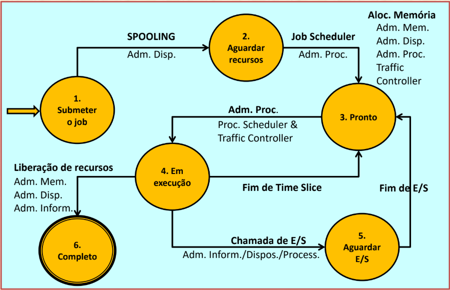

# Sistemas Operacionais - PCS3446
## Projeto 2018

Daniel Nery Silva de Oliveira - 9349051

Professor João José Neto

01/12/2018

-------------

## Introdução

Esse projeto tem como objetivo estender os conceitos explorados no projeto
da disciplina de Sistemas de Programação, expandindo o simulador da Máquina
Virtual para um simulador de Sistema Operacional

O simulador do SO foi desenvolvido em python.

## Sistema Operacional

### Jobs

Os jobs que podem ser submetidos ao SO possuem as seguintes características:

* `id` - Identifica os jobs, são incrementados automaticamente para cada job criado;
* `total_cycles` - Total de ciclos que o job precisa para ser executado;
* `arrive_time` - Ciclo do SO em que o job é submetido;
* `start_time` - Ciclo do SO em que o job é iniciado;
* `current_cycle` - Quantos ciclos o job já fez, de seu total;
* `io` - Indica se esse job terá uma operação de E/S, seu ciclo de início e sua duração;
* `priority` - Prioridade do job;
* `state` - Estado atual do job, podendo ser um entre

  1. SUBMIT
  2. WAIT_RESOURCES
  3. READY
  4. RUNNING
  5. WAIT_IO
  6. DONE

  A transição de estados segue o diagram a seguir:

Além disso, o SO aceita multiprogramação, podendo rodar até 4 jobs
simultaneamente, quando 4 jobs já estão sendo executados, os outros esperam
na fila de Pronto até que um job termine (estado 6) ou requisite uma operação de E/S (estado 5).

O funcionamento será demonstrado mais abaixo.

### Interface de Linha de Comando

Para essa simulação, foram adicionados novos comandos para o usuário, que
visam trabalhar com os diferentes jobs que podem ser submetidos ao sistema
operacional

* `$ADD [numero de ciclos] [quantidade]`

  Essa operação submete jobs ao sistema operacional, com uma duração de `[numero de ciclos]` ciclos, o parâmetro `[quantidade]` é opcional e serve para adicionar vários jobs iguais de uma vez.

  Cada job criado pode ou não ter operações de E/S, isso é escolhido aleatoriamente para efeitos de simulação, assim como o instante inicial e a duração da operação.

* `$KILL [job id]`

  Essa operação envia um evento ao Sistema Operacional para que um job em execução seja cancelado, quando o evento é processado, o job vai imediatamente para o estado de DONE e para de ser processado, caso o id não exista ou não esteja em execução, nada ocorre.

* `$LIST`

  Essa operação lista todos os jobs prontos ou em execução e seu estado atual (precisam estar nos estados 3, 4 ou 5).

### Eventos

Os eventos que podem ocorrer tem um tipo e um processamento específico, os evento implementados nessa simulação são:

* `IOFinishedEvent`

  Esse evento ocorre sempre que uma operação de E/S é concluída, associado a ele está o id do job que solicitou a operação.

* `KillProcessEvent`

  Esse evento ocorre quando há um pedido de finalização de um job, como descrito no comando $KILL do interpretador de linha de comando.

## Log

Todas as operações do Sistema Operacional são registradas num log de arquivo, que pode ser monitorado enquanto a simulação acontece para visualizar as operações.

São no formato:
`[INFO   ] system.SO: [<ciclo atual>] <mensagem>.`

## Demonstração

* Adição de um único job

Nesse exemplo, pode-se perceber o SO recebendo o job adicionado (estado 1 ->
2), o Job Scheduler adicionando o Job na fila de pronto (2 -> 3) e o
Process Scheduler iniciando o Job (3 -> 4), esse job não tem operações de E/S.

* Adição de vários jobs longos, com E/S

Nesse exemplo, foram adicionados 5 jobs de 50 ciclos, alguns deles tiveram
operações de E/S, pode-se notar que apenas 4 deles estão executando
simultaneamente

Então, depois de alguns ciclos, o job 3 requisita uma operação de E/S e o
Process Scheduler coloca o job 5 para executar.

Após um tempo, a operação de E/S do job 3 é terminada, um evento é recebido
e o Process Scheduler o coloca de volta pra ser processado (já que o job 5
havia previamente requisitado uma operação de E/S e havia um espaço livre).

* Outros comandos da interface de linha de comando

Com o comando list pode-se ver os jobs que estão prontos para serem
executados e aqueles que já estão executando.

## Conclusão

Com esse projeto, foi possível entender melhor os conceitos de
multiprogramação, além do funcionamento dos schedulers e jobs, pode-se
perceber como isso pode ser aplicado em aplicações reais, sendo que os
ciclos mostrado nos logs correspondem a ciclos reais de programas de um
Sistema Operacional.
